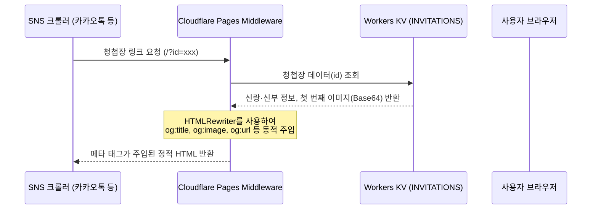

# Open Graph 설정 분석 및 추가 작업 보고서

이 프로젝트에는 **정적 Open Graph 메타 태그**뿐만 아니라, **각 청첩장별로 동적 Open Graph 정보를 주입해 주는 고급 설정(엣지 미들웨어 및 이미지 서버)**이 이미 완벽히 구축되어 있습니다. 

이번 작업에서 누락되었던 필수 표준 태그인 `og:url` 설정을 추가하여 Open Graph 구성을 100% 완료하였습니다.

---

## 1. Open Graph 동작 아키텍처

React SPA(Single Page Application)는 클라이언트 사이드에서 렌더링되므로, 카카오톡이나 페이스북 같은 SNS 크롤러가 자바스크립트를 실행하지 못하고 빈 화면만 수집하게 됩니다. 이를 해결하기 위해 이 프로젝트는 **Cloudflare Pages Functions**를 활용하여 서버 단(Edge)에서 메타 태그를 동적으로 교체하는 방식을 취하고 있습니다.



---

## 2. 관련 파일 목록 및 상세 설명

| 파일 경로 | 역할 | 주요 내용 |
| :--- | :--- | :--- |
| [index.html](file:///C:/Users/SBS/wedding-invitation/index.html) | **정적 OG 태그 정의** | 기본(빌더 페이지 등) 상태에서의 OG 태그 (`og:title`, `og:description`, `og:image`, `og:locale` 등) 정의. 이번 작업으로 `og:url` 기본값 추가. |
| [functions/_middleware.js](file:///C:/Users/SBS/wedding-invitation/functions/_middleware.js) | **동적 OG 태그 주입** | `/?id=xxx` 요청을 가로채서 KV에서 청첩장 데이터를 로드한 뒤, 신랑·신부 이름(`og:title`), 예식 일시/장소(`og:description`), 전용 이미지 주소(`og:image`), 고유 주소(`og:url`)를 HTML에 동적으로 주입. |
| [functions/api/invitations/[id]/og.js](file:///C:/Users/SBS/wedding-invitation/functions/api/invitations/%5Bid%5D/og.js) | **동적 OG 이미지 변환** | 카카오톡 등은 Base64 데이터 URL을 인식하지 못하므로, KV에 저장된 첫 번째 갤러리 이미지(Base64)를 실제 바이너리 이미지(`image/jpeg` 등)로 디코딩하여 응답해 주는 API 엔드포인트. |
| [public/og-image.png](file:///C:/Users/SBS/wedding-invitation/public/og-image.png) | **기본 OG 이미지** | 갤러리 이미지가 등록되지 않았거나 오류 발생 시 보여줄 기본 청첩장 썸네일 이미지. |

---

## 3. 이번에 개선한 사항 (`og:url` 추가)

Open Graph 표준 스펙의 필수 항목 중 하나인 `og:url`이 누락되어 있어, 공유 시 canonical URL이 매칭되지 않거나 공유 누적 카운트 분산 등의 문제가 생길 수 있었습니다. 이를 해결하기 위해 두 파일을 수정했습니다.

### ① [index.html](file:///C:/Users/SBS/wedding-invitation/index.html)
정적 메타 태그에 기본 `og:url` 추가:
```diff
     <!-- Open Graph -->
     <meta property="og:type" content="website" />
+    <meta property="og:url" content="/" />
     <meta property="og:title" content="모바일 청첩장 — 두 사람의 결혼식에 초대합니다" />
```

### ② [functions/_middleware.js](file:///C:/Users/SBS/wedding-invitation/functions/_middleware.js)
서버 엣지 미들웨어에서 `id`별로 absolute 공유 주소를 생성하여 동적으로 교체:
```diff
   const imageUrl = hasImage
     ? `${url.origin}/api/invitations/${encodeURIComponent(id)}/og?v=${version}`
     : `${url.origin}/og-image.png`;
+  const canonicalUrl = `${url.origin}/?id=${encodeURIComponent(id)}`;
 
   return new HTMLRewriter()
     .on('title', {
       element(el) {
         el.setInnerContent(title);
       },
     })
     .on('meta[name="description"]', new SetMetaContent(description))
+    .on('meta[property="og:url"]', new SetMetaContent(canonicalUrl))
     .on('meta[property="og:title"]', new SetMetaContent(title))
```

---

## 4. 로컬 검증 및 캐시 삭제 방법

> [!IMPORTANT]
> **로컬 개발 환경(`npm run dev`) 주의사항**
>
> `npm run dev`는 Vite 개발 서버로 정적 프런트엔드 파일만 서빙합니다. 따라서 Cloudflare Pages Functions(엣지 미들웨어 및 API)는 동작하지 않으므로, 로컬 환경에서는 동적 Open Graph 동작을 테스트할 수 없습니다. 
> 
> 로컬에서 백엔드 동작까지 확인하려면 wrangler를 사용하여 `wrangler pages dev` 명령으로 실행하고 KV 바인딩 설정을 연계해주어야 합니다.

> [!TIP]
> **카카오톡 링크 미리보기 캐시 초기화**
>
> 카카오톡은 한 번 수집한 링크 미리보기 정보를 끈질기게 캐싱하므로, 청첩장 내용을 변경하거나 테스트 중 썸네일이 갱신되지 않으면 카카오 개발자 도구에서 캐시를 직접 삭제해주어야 합니다.
> - **도구 위치**: [카카오 og 캐시 초기화 도구](https://developers.kakao.com/tool/clear/og)
> - **초기화 방법**: 생성된 배포 URL(예: `https://<domain>/?id=xxx`)을 주소창에 입력하고 **초기화**를 실행하세요.
